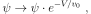

# pyschroedinger

A game of __pong__ where the ball is not a classical particle, rather a
quantum-mechanical wavefunction.

**License**: [Creative Commons Attribution 4.0 International (CC BY-NC-SA 4.0)](https://creativecommons.org/licenses/by-nc-sa/4.0/). See [LICENSE.md](LICENSE.md) in this repository.

## The game

STUFF TO PLAY, see below

### Music and sound

(pcm 16 bit and dir names)

### Tweaking in-code settings

xxx

## The physics

For more details, see the dedicated page about the [underlying physics](docs/physics.md).

The game is built upon a general integrator for the Schroedinger equation. Actually
there are several of them, one- and two- dimensional and with various features
(time-dependent vs. static potential, naive vs. Runge-Kutta integrator, etc).

In the game, a few small tweaks are introduced on top of the integration
to correct for effects that would make the game hardly playable (see below).

One- and two-dimensional "playground" setups, aside from the game itself,
are available to play and experiment with the core integrator engine, as
illustrated in the examples below.

### Examples

__Tunnel effect__: A (one-dimensional) Gaussian wave packet (mass is half that of the electron)
hits a finite potential barrier and tunnels through it (with periodic B.C.):


__Two-slit experiment__: A two-dimensional "almost-plane wave" hits a very steep potential wall with two slits
and the portion of wave that goes through produces the famous interference pattern on the other side of the field.
With a particle of half the mass of the electron and a field roughly of side 4000 fm, the scene depicted here
spans about 0.000001 fs.
(After a while the motion of the wavefunction gets very messy: this is because, with fixed
boundary conditions in both directions, the borders reflect back the wave, which then starts interfering
with itself.)


(_Note_: to generate the frames for this example, the program was tweaked to display both the potential and
the wavefunction; even more crucial, due to my incomplete knowledge of `pygame`, was the choice to make without
the 8-bit color palette, using instead full RGB colors for the rendering of the image -- that seemed
to be the only way to get the right colors on the saved picture files.)

## Game-specific physics "tweaks"

In the game, the player control a "pad" that is, in fact, an island of high potential
in the system, whose position changes over time. This leads to two unpleasant
consequences that have to be addressed, at the cost of tweaking a bit the
quantum evolution of the system, to keep the game playable:

(1) Since the pad motion is discrete, it so happens that the pad slides under a
region where the wavefunction has a high value: this, effectively, raises the total
energy of the system in an unwarranted way, a fact which mostly manifests itself
as a growth of high-frequency components in the wavefunction (a rougher and rougher psi).
To keep this under control, a smoothing matrix, designed to kill high frequencies, is applied
to psi whenever, after the update iteration, the new total energy exceeds a threshold
set by the initial energy of the system.

(2) Another consequence of the discretised time steps is the fact that, when the pad
slides under a region with large psi, the latter is effectively "trapped" there (the pad having
a constant potential at its core. If one had infinitesimal time steps, the wave function
would be, correctly, pushed away by the gradient of the potential at the rim of the pads:
here, to avoid trapping large portions of the wave function within the pad, we apply a damping
factor at each iteration of type 



with v<sub>0</sub> chosen as large as possible as long as it does its job. Unfortunately,
this is a minor tweak that may hinder e.g. exploiting the tunnel effect in
some way throughout the game.

## Credits

## Todo

Refactor documentation: main (game + physics), physics, demo animations.
Pictures of equations -> locally stored.

Restructure DOC/readme

wavefunction push-forward? how?

Deep refactoring of the qpong part: make it readable, more smaller modules!

Credits/info page

symmetry of evolution: minor bias to the right remains (?),
strips for winning-checks.
It must all be symmetrical.

Critical review of all sound effects and music

```
    ====
```


## Get it running

__TO UPDATE HEAVILY__

Clone the repo, create the virtualenv
(with python3) and set the repo's root
dir into the path of the virtualenv.

Then, in order to play, go to the
`qpong` directory and start

    ./game.py

(optionally passing the `-1` option to experiment with one-player)

Alternatively, to have a look at the integrator
in a non-interactive fashion,
go to either `oneD` or `twoD` directories, start

    ./schroedinger.py

and enjoy the show (after tweaking the code and/or the parameters,
if you feel so inclined).

You can alter the initial wavefunction/potential by playing with the `initPhi`
and `initPot` functions in `schroedinger.py`, and you can tweak more fundamental
settings (time interval, grid size, boundary conditions, and so on) in `settings.py`;
game-specific settings are in `twoD/interactiveSettings.py`.

### Basic structure of the project

The one- and two-dimensional cases are in two different subdirectories
and share almost nothing.
The dynamics (i.e. integrators) and the GUI reside in separate modules,
and are used by the main driver and - in the case of two dimensions - 
the game as well.

