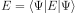
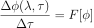

# Physics

## Units

We choose natural units and set , so to recover the ordinary units:
  <!-- "https://latex.codecogs.com/svg.latex?\hbar{\cdot}c=\hbar=c=1" #fml_units1 -->

  <!-- "https://latex.codecogs.com/svg.latex?\hbar=200~\frac{\mathrm{MeV~fm}}{c}" #fml_units2 -->

  <!-- "https://latex.codecogs.com/svg.latex?\hbar{c}=200~\mathrm{MeV}~\mathrm{fm}~\Rightarrow~1~\mathrm{fm}=\frac{\hbar{c}}{200~\mathrm{MeV}}" #fml_units3 -->

  <!-- "https://latex.codecogs.com/svg.latex?c=3\cdot{10}^{8}~\mbox{m/s}~\Rightarrow~1~\mathrm{fs}=1.5\cdot{10}^6\frac{\hbar}{\mbox{MeV}}" #fml_units4 -->

### Space and time

We work in a box of size L and proceed by time steps &Delta;t (in physical units).
The length of the box is divided into Nx discrete intervals.

### Dimensions

Since the norm of Psi has to be a number,  implies:
  <!-- "https://latex.codecogs.com/svg.latex?\int|\Psi|^2\mathrm{d}^dx=[1]" #fml_dimensions1 -->

  <!-- "https://latex.codecogs.com/svg.latex?[\Psi]=\mathrm{fm}^{-d/2}=\mathrm{MeV}^{d/2}" #fml_dimensions2 -->

Now for the units of the potential V (in one dimension for brevity):

  <!-- "https://latex.codecogs.com/svg.latex?i\hbar\frac{\mathrm{d}\Psi}{\mathrm{d}t}=-\frac{\hbar^2}{2m}\frac{\mathrm{d}^2\Psi}{\mathrm{d}x^2}+V\Psi" #fml_dimensions3 -->

means

  <!-- "https://latex.codecogs.com/svg.latex?\frac{\mathrm{MeV}\cdot{fm}}{c}\cdot\frac{1}{\mathrm{fm/c}}\cdot\mathrm{MeV}^{d/2}=\frac{\mathrm{MeV}^2\mathrm{fm}^2}{c^2}\frac{c^2}{\mathrm{MeV}}\frac{\mathrm{MeV}^{d/2}}{\mathrm{fm}^2}+[V]\mathrm{MeV}^{d/2}" #fml_dimensions4 -->

i.e.

  <!-- "https://latex.codecogs.com/svg.latex?\mathrm{MeV}=\mathrm{MeV}+[V]" #fml_dimensions5 -->

hence .
  <!-- "https://latex.codecogs.com/svg.latex?[V]=MeV" #fml_dimensions6 -->

### Reference scale

We introduce the dimensionful scale 
  <!-- "https://latex.codecogs.com/svg.latex?m_e=0.5\frac{\mathrm{MeV}}{c^2}" #fml_scale1 -->
("electron mass") to make everything dimensionless in the calculations: noting that

,
  <!-- "https://latex.codecogs.com/svg.latex?\frac{1}{m_e}=2\frac{c^2}{\mathrm{MeV}}=400\frac{c}{\hbar}\mathrm{fm}=1.33\cdot{10}^{-6}\frac{c^2}{\hbar}\mathrm{fs}" #fml_scale2 -->

one translates physical lengths L (and their increments &Delta;L) to

,
  <!-- "https://latex.codecogs.com/svg.latex?\lambda=L\frac{m_ec^2}{\hbar{c}}" #fml_scale3 -->

times t to

,
  <!-- "https://latex.codecogs.com/svg.latex?\tau=tc\frac{m_ec^2}{\hbar{c}}" #fml_scale4 -->

masses m to

,
  <!-- "https://latex.codecogs.com/svg.latex?\mu=\frac{m}{m_e}" #fml_scale5 -->

potentials V to

,
  <!-- "https://latex.codecogs.com/svg.latex?v=\frac{V}{m_ec^2}" #fml_scale6 -->

wave numbers k to

  <!-- "https://latex.codecogs.com/svg.latex?h=\frac{k}{m_ec/\hbar}" #fml_scale7 -->

and the wave function &Psi; to

.
  <!-- "https://latex.codecogs.com/svg.latex?\phi=\frac{\Psi}{\left(\frac{m_ec}{\hbar}\right)^{d/2}}" #fml_scale8 -->

## Dimensionless Schroedinger equation

Under the change to dimensionless variables,

  <!-- "https://latex.codecogs.com/svg.latex?i\hbar\frac{\mathrm{d}\Psi}{\mathrm{d}t}=-\frac{\hbar^2}{2m}\frac{\mathrm{d}^2\Psi}{\mathrm{d}x^2}+V\Psi" #fml_dless_1 -->

becomes then

  <!-- "https://latex.codecogs.com/svg.latex?i\frac{\Delta\phi}{\Delta\tau}=-\frac{1}{2\mu}\frac{\Delta^2\phi}{\Delta\lambda^2}+v\phi" #fml_dless_2 -->

i.e.

  <!-- "https://latex.codecogs.com/svg.latex?\Delta\phi=-i\Delta{\tau}\left[-\frac{1}{2\mu}\frac{\Delta^2\phi}{\Delta\lambda^2}+v\phi\right]" #fml_dless_3 -->

## Frequencies, imposing periodicity

We enforce the requirement that each frequency inserted into the initial
wave function be a multiple of a fundamental one: this prevents, in case
of periodic boundary conditions, the occurrence of discontinuities.

Physically, we require that eikL=1, which implies

.
  <!-- "https://latex.codecogs.com/svg.latex?h\lambda=2\pi{m}h_0~,~h_0=\frac{2\pi}{\lambda}" #fml_freq_1 -->

The fact that any mode must have a wave number that is a multiple of the above
h0 is enforced in the code (by approximating any naively set value).

## Energy of the system

With the caveat that the value of the potential at its minimum is arbitrary
(we customarily set it to zero, however), we calculate the energy as

  <!-- "https://latex.codecogs.com/svg.latex?E=\langle\Psi|E|\Psi\rangle" #fml_energy_1 -->

which in dimensionless units leads to

,
  <!-- "https://latex.codecogs.com/svg.latex?E=m_ec^2\cdot{e}" #fml_energy_2 -->

where

  <!-- "https://latex.codecogs.com/svg.latex?e=\Delta\lambda\sum_i\phi^\star_i\left(-\frac{1}{2\mu}\frac{\Delta^2}{\Delta\lambda^2}+v\right)\phi_i" #fml_energy_3 -->

### Approximate lightweight calculation:

We exploit the evolution of the system between successive plotted timesteps:
the two wavefunctions (before and after) encode the energy operator, hence
(using the fact that the norm of the wavefunction is one)

  <!-- "https://latex.codecogs.com/svg.latex?\langle{E}\rangle=\langle{H}\rangle=i\hbar\langle{\psi}|\frac{\mathrm{d}|\psi\rangle}{\mathrm{d}t}=i\hbar\langle{\psi}|\frac{|\phi(t+\mathrm{d}t)\rangle-|\phi(t)\rangle}{\mathrm{d}t}=i\hbar\frac{1-\langle\phi(t+\mathrm{d}t)|\phi(t)\rangle}{\mathrm{d}t}" #fml_energy_4 -->

In this way we do not need to perform additional computation to get the energy, save for a simple scalar
product between the two successive wavefunction vectors.

In practice we use the wavefunction before and after a single timestep &Delta;&tau;, meaning that
the results deviates from the true energy in a way that goes to zero as the timestep goes to zero.

In the adimensional units, the energy calculated in this way is given by:

.
  <!-- "https://latex.codecogs.com/svg.latex?e=\langle\phi|\left[-\frac{1}{2\mu}\frac{\mathrm{d}^2}{\mathrm{d}\lambda^2}+v\right]|\phi\rangle=\frac{i}{\Delta\tau}\langle\phi_\tau|\left(\phi_\tau-\phi_{\tau-\Delta\tau}\right)\rangle" #fml_energy_5 -->

_Note_: this calculation introduces too large a bias in typical configurations, hence it is discarded
in favour of the exact one based on the actual definition of energy. The latter, if properly implemented,
hitches a ride on the system evolution (at least in the case of the time-dependent potential integrator)
and introduces practically no additional overhead.

## Boundary conditions

Periodic and fixed can be chosen; with periodic b.c. one has a little more control over divergencies
and spurious high-frequency modes that may arise; however, a proper tuning of the relationship between
time and space integration intervals keeps them under control when using the Runge-Kutta scheme
described below. In any case the whole-frequency enforcing is performed regardless of the boundary conditions.

## Fourth-order Runge-Kutta integration scheme

The explicit implementation that is used in this code is as follows:
calling F the discrete evolution operator, as in

,
  <!-- "https://latex.codecogs.com/svg.latex?\frac{\Delta\phi(\lambda,\tau)}{\Delta\tau}=F[\phi]" #fml_rk_1 -->

the following spatial functions are calculated:

  <!-- "https://latex.codecogs.com/svg.latex?k_1=F[\phi]" #fml_rk_2 -->

  <!-- "https://latex.codecogs.com/svg.latex?k_2=F[\phi+\frac{\Delta\tau}{2}k_1]" #fml_rk_3 -->

  <!-- "https://latex.codecogs.com/svg.latex?k_3=F[\phi+\frac{\Delta\tau}{2}k_2]" #fml_rk_4 -->

  <!-- "https://latex.codecogs.com/svg.latex?k_4=F[\phi+\Delta\tau{k_3}]" #fml_rk_5 -->

so that for the next update step the wave function has been incremented by

  <!-- "https://latex.codecogs.com/svg.latex?\Delta\phi=\frac{\Delta\tau}{6}\left[k_1+2k_2+2k_3+k_4\right]" #fml_rk_6 -->

### Matricial form of the RK scheme

The Runge-Kutta approach above is linear in the wave function, so it can be
recast in terms of the action of a matrix H acting on &phi; to produce the
wavefunction for the next timestep.

Moreover, if &phi; becomes 1+&Delta;&phi; in each single timestep, then
one can perform N updates as one matrix operation after building

,
  <!-- "https://latex.codecogs.com/svg.latex?U=(1+H)^N" #fml_rk_7 -->

so that the (N-fold) update reads &phi; &#x2192; U&phi;. In turn, calling
&Delta;&tau; the "small" timestep, H is built as

,
  <!-- "https://latex.codecogs.com/svg.latex?H=(\mathcal{F}+\frac{\mathcal{F}^2}{2}+\frac{\mathcal{F}^3}{6}+\frac{\mathcal{F}^4}{24})" #fml_rk_8 -->

where
.
  <!-- "https://latex.codecogs.com/svg.latex?\mathcal{F}=\Delta\tau\cdot{F}" #fml_rk_9 -->

_Note_: In cases where the potential is a function of time, however, all of this pre-processing is
not very useful, probably, since most of the computation will need to be performed at each
change of the potential (i.e. possibly at each draw operation or even time step).
